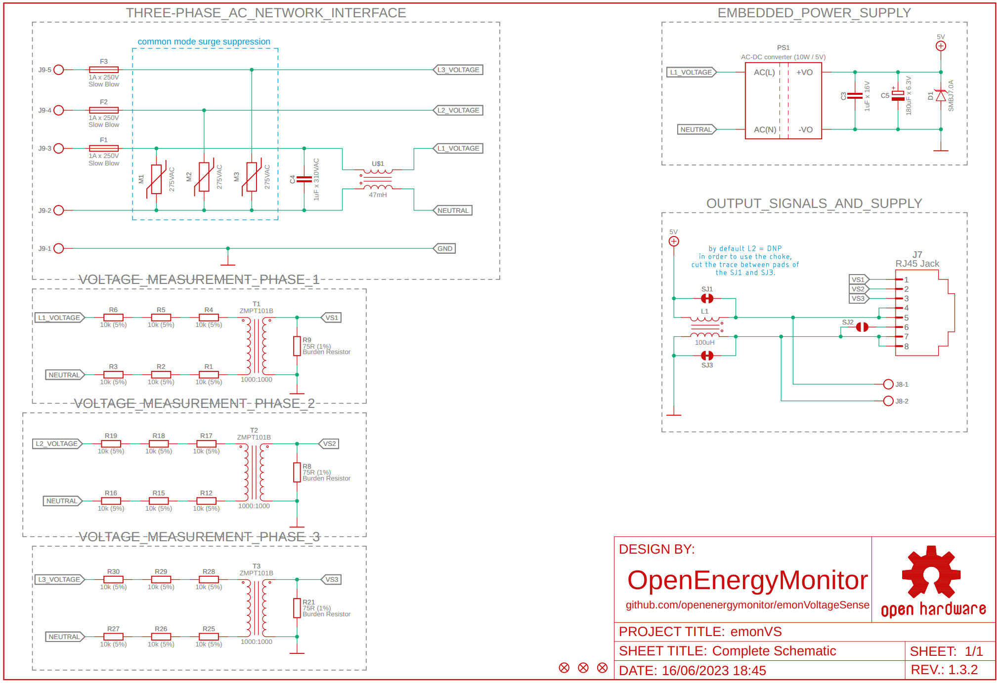

# emonVS

AC voltage sensor and power supply for [emonTx V4](https://github.com/openenergymonitor/emontx4) and [emonPi V2](https://github.com/openenergymonitor/emonpi2).

 | |
--- | ---

## Outputs
- The **RJ45 connector** is used to provide power supply and AC voltage sample to [emonTx V4](https://github.com/openenergymonitor/emontx4) and [emonPi V2](https://github.com/openenergymonitor/emonpi2).

- The **2-pins terminal block connector** from emonVS (CN3) can supply power to an [emonBase](https://github.com/openenergymonitor/emonbase) using a open-ended USB-C connector.

## Schematic Preview
Click to [download .pdf file](1.3.2/emonVS.pdf).  

## Bill of Materials
| Qty | Designator | Description | PN |
|--|--|--|--|
1	|C1|	1uF x 16V|	GCM188R71C105KA64D| 
1	|C2|	180uF x 6.3V|	6SVPE180M|
1	|C3|	1uF x 310VAC|	B32923C3105M000|
1	|CN1|	Terminal block, 5 pins, 5 mm pitch|	282836-5|
1	|CN3|	Terminal block, 2 pins, 5 mm pitch|	282836-2|
1	|CN2|	RJ45 Jack|	PRT-00643|
1	|D1|	TVS diode|	SMBJ7.0A|
3	|F1, F2, F3|	Slow blow fuse, 1A X 250V|	MST 1A 250V|
1	|L1|	Common Mode Choke, 47mH|	RN214-0.3-02-47M|
1	|L2|	Common Mode Choke, 100uH|	744252101|
1	|PS1|	AC-DC converter, 10W / 5V|	MP-LD10-23B05R2|
18	|R1, R2, R3, R4, R5, R6, R12, R15, R16, R17, R18, R19, R25, R26, R27, R28, R29, R30|	10k (5%)|	ERJ-H3GJ103V|
3	|R4, R11, R18|	75R (1%)|	ERJ-H3EF75R0V|
3	|RV1, RV2, RV3|	Varistor, 275VAC|	MOV-14D431KTR|
3	|T1, T2, T3|	Micro-transformer, 1000:1000 ratio|	ZMPT101B|

## 3D Model Preview
Click to [download .step file](1.3.2/assets/emonVS%20v1.3.step).  

