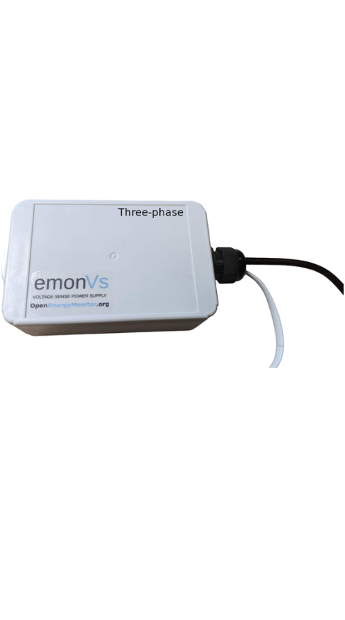
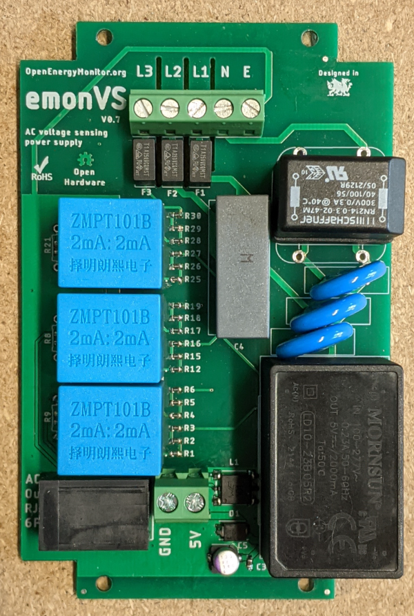
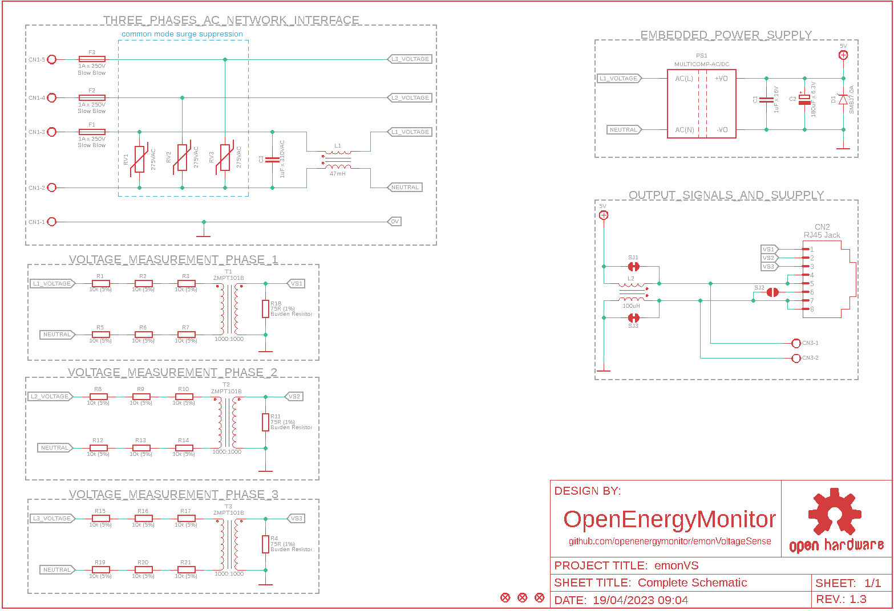

# emonVS

AC voltage sensor and power supply for [emonTx V4](https://github.com/openenergymonitor/emontx4) and [emonPi V2](https://github.com/openenergymonitor/emonpi2).

 | |
--- | ---

## Outputs
- The **RJ45 connector** is used to provide power supply and AC voltage sample to [emonTx V4](https://github.com/openenergymonitor/emontx4) and [emonPi V2](https://github.com/openenergymonitor/emonpi2).

- The **2-pins terminal block connector** from emonVS (CN3) can supply power to an [emonBase](https://github.com/openenergymonitor/emonbase) using a open-ended USB-C connector.

## Schematic Preview 

## Change Log 

### V1.1 R11 output
Sep 2022

### V1.3.2 RJ45 output
July 2023

### V1.4.2 
Jan 2026

- Add copper around resistors
- Change AC-DC power supply module 
- Change voltage sensor resistors 
- Change burden resistor 
- Change output capacitor 
- Increase spacing of ZMPT101B to support ZMPT101K

